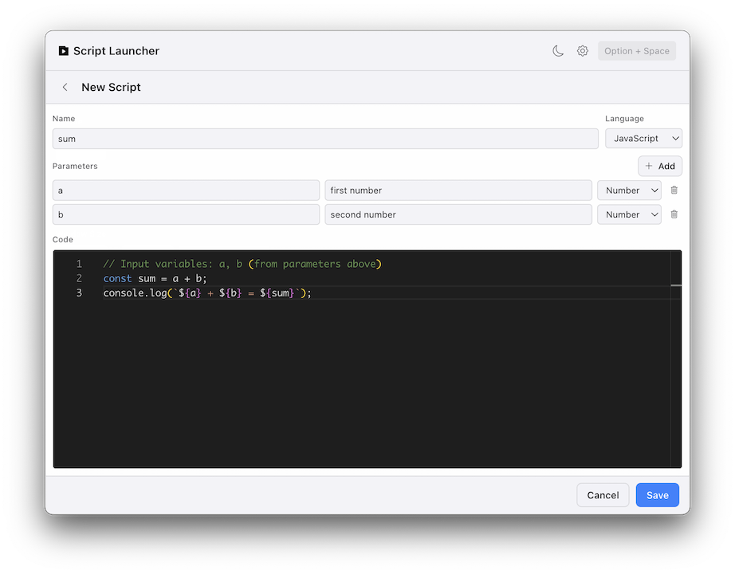
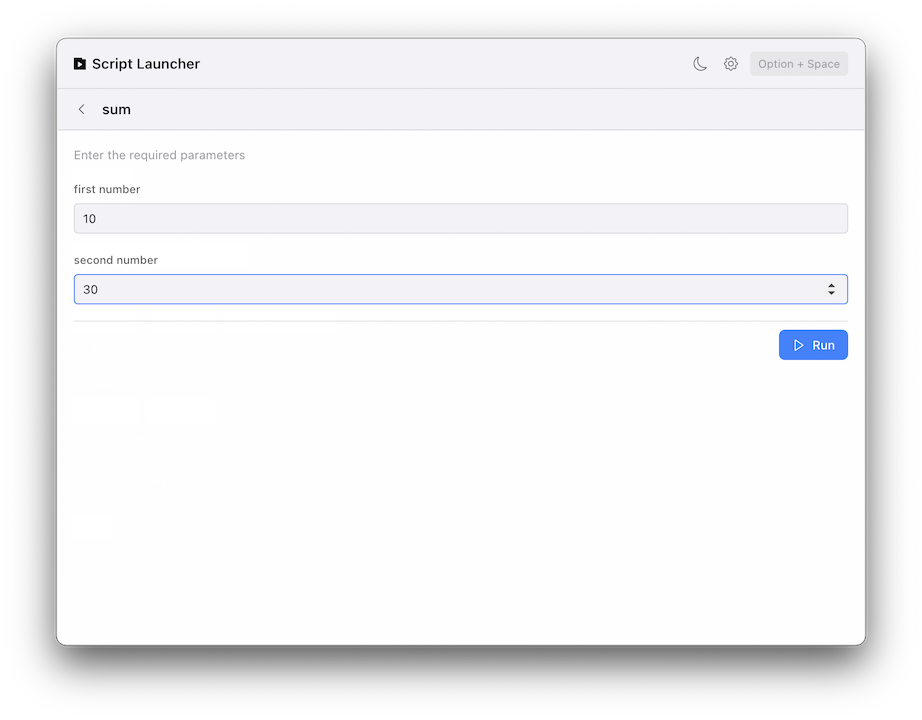

<p align="left">
  
</p>

Launch scripts quickly with hotkeys. Supports JavaScript, Python, and Shell scripts.

## Screenshots

|    Feature    |                        Screenshot                        |
| :-----------: | :------------------------------------------------------: |
|  Script List  |    |
|  Edit script  |    |
| Launch script |  |
| Launch result |  |

## Use case

- Open cursor project
  ```bash
  /usr/local/bin/cursor ~/ProjectPath/ProjectName
  ```
- Build simple devtools

## Run

```bash
# Development mode
npm run dev

# Production build
npm run start

# Package the app
npm run package
```

## Shortcuts

| Key              | Action            |
| ---------------- | ----------------- |
| `Option + Space` | Open/Close App    |
| `↑` `↓`          | Select Item       |
| `←` `→`          | Open/Close Folder |
| `Enter`          | Run / Toggle      |
| `Esc`            | Close Window      |

## License

MIT
